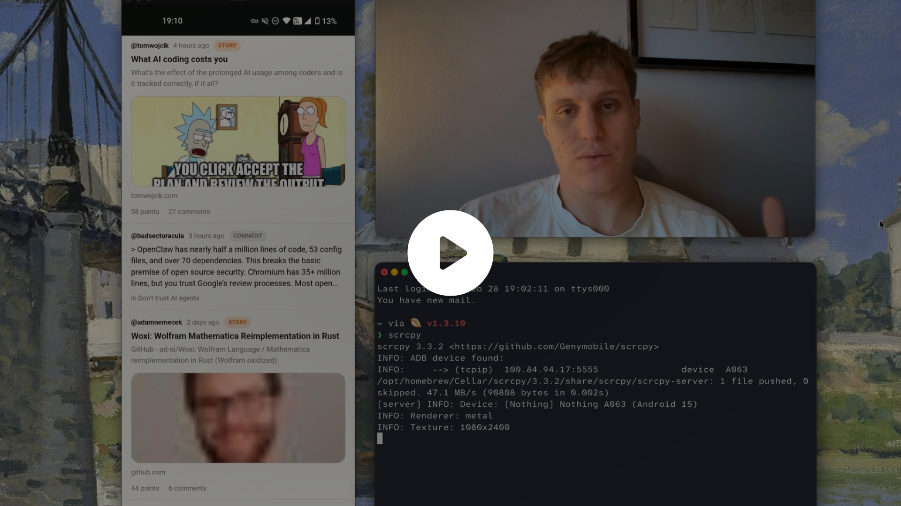
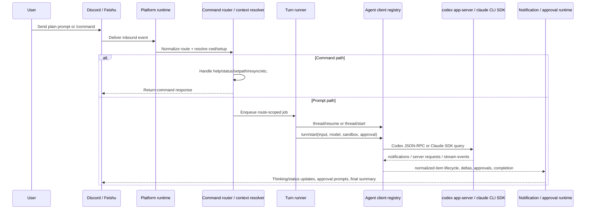

# Agent Gateway

[](https://youtu.be/RRF-F5jDS50)

Multi-platform agent gateway for Codex app-server and Claude Code.

## What It Does

- Bridges Discord and Feishu chats into route-scoped agent sessions.
- Supports multiple Discord and Feishu bot instances at the same time, with each bot fixed to either `codex` or `claude`.
- Uses top-level `bots` config for fixed-runtime deployments, while keeping legacy single-bot `channels` compatibility.
- Auto-discovers Discord project routes from Codex `cwd` metadata and manages project channels under `codex-projects`.
- Supports config-driven Feishu route bindings plus open unbound-chat fallback mode.
- Persists one session binding per route:
  - Discord/Feishu route -> Codex thread id or Claude session UUID
- Queues one active turn per route and keeps recovery metadata for restart-safe turn status + retry flows.
- Streams assistant output as segmented messages with separate status/tool updates instead of one long edited message.
- Handles approvals through Discord buttons plus text commands, or text commands only on Feishu.
- Supports inbound image input on both platforms, plus Feishu inbound file bridging and outbound file/image uploads.
- Exposes operator HTTP endpoints for health, readiness, turn lookup, and retry.

## Architecture Map

```text
src/index.js                  Thin runtime entrypoint (`startMainRuntime`)
src/app/mainRuntime.js        Compose runtime context + process runner
src/app/loadRuntimeBootstrapConfig.js Env/config/state bootstrap loading
src/app/buildRuntimeGraph.js  Build core runtime services/adapters/turn runner
src/app/runBridgeProcess.js   Wire listeners/runtimes/startup/shutdown flow
src/config/loadConfig.js      Env + channel config loading/normalization
src/channels/context.js       Channel/repo context and bindings
src/codexRpcClient.js         Codex app-server transport
src/claudeClient.js           Claude Code SDK transport wrapper
src/clients/agentClientRegistry.js Runtime-aware client registry (`codex` / `claude`)
src/codex/turnRunner.js       Per-channel queue and turn lifecycle
src/codex/notificationMapper.js Normalized notification boundaries
src/codex/approvalPayloads.js Approval request/response mapping
src/attachments/service.js    Attachment candidate extraction + upload policy
src/render/messageRenderer.js Message render plan, redaction, chunking
src/cli/**                    Operator CLI (`status`, `capabilities`, `doctor`, `start`, `stop`, `reload`, `logs`)
src/app/main.ts               TS bootstrap entry used by `start:ts`
src/types/**                  TS boundary contracts for cutover
```

## Requirements

- Bun 1.2+
- `codex` CLI installed on the host and authenticated
- For Discord:
  - bot token with `MESSAGE CONTENT INTENT` enabled
  - channel read/send permissions in your server
  - `DISCORD_GUILD_ID` if the bot belongs to more than one guild
- For Feishu:
  - app credentials with message event subscription enabled

## Setup

1. Load `.env`, `config/channels.json`, and `data/state.json`.
2. Start the backend HTTP server if enabled.
3. Start `codex app-server` and finish the `initialize` handshake.
4. Start enabled platforms through the platform registry.
5. Register Discord slash commands if Discord is enabled.
6. Start Feishu transport in webhook or long-connection mode if Feishu is enabled.
7. Reconcile any in-flight turn recovery state.
8. Bootstrap Discord managed project channels from Codex `thread/list`.
9. Start heartbeat writes and mark `/readyz` healthy.

## End-to-End Flow



### Prompt Lifecycle

1. A platform runtime receives an inbound message or command event.
2. The route is resolved to a setup with `cwd`, model, mode, and write policy.
3. Command messages are handled immediately by the shared command router.
4. Prompt messages are queued by route, so one chat never runs overlapping turns.
5. The turn runner resolves the correct runtime client and resumes or starts the route session.
6. `turn/start` is sent to either `codex app-server` or the Claude Code SDK with model, sandbox, and approval policy.
7. Notifications stream back into the notification runtime, which renders status, summaries, diffs, and attachments.
8. Approval requests are intercepted by the approval runtime and sent back to the originating route.
9. On success or failure, the route's current session binding is persisted for the next message.

## Supported Route Types

| Platform | Route type | How it is created | Write mode | Notes |
| --- | --- | --- | --- | --- |
| Discord | Managed repo text channel | Auto-discovered from Codex `cwd`, or bound with `!initrepo` on a Codex-backed Discord bot | Writable by default | Plain text messages become prompts |
| Discord | `#general` | Existing text channel matched by ID or name | Read-only | Useful for discussion and planning |
| Feishu | Mapped repo chat | Preferred: `bots.<botId>.routes.<chat_id>` in `config/channels.json` | Writable by default | Text, image, and file input; platform-native replies and uploads |
| Feishu | Open unbound chat | Any chat when `FEISHU_UNBOUND_CHAT_MODE=open` | Writable by default | Falls back to `FEISHU_UNBOUND_CHAT_CWD`, then `WORKSPACE_ROOT`, then bridge cwd |
| Feishu | General chat | `FEISHU_GENERAL_CHAT_ID` | Read-only | Similar to Discord `#general` |

## Capability Summary

| Capability | Discord | Feishu |
| --- | --- | --- |
| Persistent agent session per route | Yes | Yes |
| In-chat route rebinding | `!setpath`, `/setpath` | `/setpath` |
| Auto-discover routes from Codex `cwd` | Yes | No |
| Auto-create/manage chat containers | Yes | No |
| Native slash commands | Yes | No |
| Text `/command` style input | No | Yes |
| Approval buttons | Yes | No |
| Text approval commands | Yes | Yes |
| Image input bridging | Yes | Yes |
| File input bridging | No | Yes |
| Incremental answer streaming | Yes | Yes |
| Read-only general chat mode | Yes | Yes |
| Open unbound chat fallback | No | Yes |
| Webhook-less transport | N/A | Yes, `FEISHU_TRANSPORT=long-connection` |

## Runtime Model

### Route Binding Model

- A route is the stable chat identifier the bridge uses internally.
- Each live chat route belongs to exactly one configured bot instance.
- Discord external route ids use the raw text channel id inside `bots.<botId>.routes`.
- Feishu external route ids use the raw `chat_id` inside `bots.<botId>.routes`.
- Internal queue/state keys are namespaced as `bot:<botId>:route:<externalRouteId>`.
- Each route resolves to one setup object: `cwd`, `model`, mode, and write policy.
- Each route also maps to one persistent runtime session binding in `data/state.json`.

### Execution Model

- Every route has its own FIFO queue.
- Only one turn per route runs at a time.
- The bridge tries `thread/resume` before `thread/start`, so the same chat keeps context across turns.
- If the `cwd` for a route changes, the old session binding is cleared and the next prompt starts fresh in the new working directory.

### Platform Model

- The platform registry is the boundary between core bridge logic and chat integrations.
- Discord and Feishu declare capabilities such as attachments, buttons, repo bootstrap, auto-discovery, and webhook ingress.
- Shared code asks for capabilities instead of branching on platform names whenever possible.

### Agent Model

- Agent definitions are loaded from `channels.json > agents`.
- Each agent can specify `runtime: "codex"` or `runtime: "claude"` to choose the backend.
- In multi-bot mode, the bot is the runtime source of truth: every route handled by that bot uses the bot's fixed runtime.
- Agent/runtime mismatches are rejected at config load time. A `claude` bot cannot host a `codex` agent route, and vice versa.
- Route resolution still chooses `agentId + model` in this order: route override -> `defaultAgent` -> default model fallback.
- Agent capabilities are checked through a shared registry instead of per-platform hardcoding.
- Current capability in active use: `supportsImageInput`.

### Runtime Model (Codex vs Claude)

The gateway supports two agent runtimes:

| Feature | Codex Runtime | Claude Runtime |
| --- | --- | --- |
| Backend | `codex app-server` JSON-RPC | `claude` CLI SDK |
| Session model | Thread ID from `thread/start` | Session ID from `system/init` |
| Stored resume token | Codex thread id | Claude session UUID |
| Model handling | Uses configured model directly | Uses configured Claude model through the SDK/CLI |
| Approval surface | Platform-driven: Discord buttons + text, Feishu text | Platform-driven: Discord buttons + text, Feishu text |
| Session resume | `thread/resume` with thread ID | `--resume` with session UUID |
| Notification flow | Codex notifications normalized into render items | Claude SDK messages normalized into the same render pipeline |

For Claude agents:
- Configure `runtime: "claude"` in the agent definition.
- The gateway auto-generates temp IDs and updates to real session IDs on first turn.
- Session IDs are UUIDs persisted for resume capability.
- Approval UX is decided by platform, not by runtime: Discord can still render buttons, while Feishu uses text commands.

## Quick Start

### Requirements

- Bun `1.2+`
- Node.js `20+` if you use `bun run start:backend`, `launchd`, or `systemd`
- `codex` CLI installed on the host and already authenticated
- `claude` CLI (Claude Code) version `2.x` or later if using Claude runtime agents
- At least one chat platform configured:
  - Discord bot token with `MESSAGE CONTENT INTENT` enabled
  - or Feishu app credentials with `im.message.receive_v1` enabled for either webhook or long-connection mode
    - optionally subscribe `im.chat.member.bot.added_v1` if you want a welcome/onboarding message when the bot is added to a new group

### Install

```bash
bun install
cp .env.example .env
cp config/channels.example.json config/channels.json
```

### Minimal Discord-only `.env`

```bash
DISCORD_BOT_TOKEN=replace-me
DISCORD_ALLOWED_USER_IDS=123456789012345678
WORKSPACE_ROOT=/Users/you/projects
BACKEND_HTTP_ENABLED=1
BACKEND_HTTP_HOST=127.0.0.1
BACKEND_HTTP_PORT=8788
```

`DISCORD_GUILD_ID` is optional when the bot is in exactly one guild. If the bot belongs to multiple guilds, set it explicitly.

### Minimal Feishu-only `.env`

```bash
FEISHU_APP_ID=cli_xxx
FEISHU_APP_SECRET=replace-me
# Optional; defaults to webhook. Set to long-connection to avoid callback URLs.
# FEISHU_TRANSPORT=long-connection
```

Optional hardening and routing overrides:

```bash
# FEISHU_VERIFICATION_TOKEN=replace-me
# FEISHU_ALLOWED_OPEN_IDS=ou_xxx
# WORKSPACE_ROOT=/Users/you/projects
# FEISHU_UNBOUND_CHAT_CWD=/Users/you/projects/default-repo
# BACKEND_HTTP_HOST=0.0.0.0
# BACKEND_HTTP_PORT=8788
# FEISHU_WEBHOOK_PATH=/feishu/events
```

Feishu repo chats do not auto-discover. New chats are usable by default through the open unbound workspace, which falls back to `FEISHU_UNBOUND_CHAT_CWD`, then `WORKSPACE_ROOT`, and finally the bridge working directory. Add `bots.<botId>.routes.<chat_id>` mappings to `config/channels.json` when you want a stable per-chat repo binding, or keep using legacy top-level `feishu:<chat_id>` keys in single-bot mode.

Transport notes:

- `FEISHU_TRANSPORT=webhook` is the default and requires a reachable callback URL.
- `FEISHU_TRANSPORT=long-connection` connects out to Feishu over WebSocket and does not require a public callback URL.

### Start Modes

Foreground:

```bash
bun run start
```

Proxy-aware backend wrapper, recommended for long-running service mode:

```bash
bun run start:backend
```

`start:backend` loads `.env`, applies `HTTP_PROXY` or `HTTPS_PROXY` to HTTP and WebSocket traffic, then starts the normal bridge entrypoint.

### Verify

```bash
agent-gateway doctor
agent-gateway status
curl http://127.0.0.1:8788/healthz
curl -i http://127.0.0.1:8788/readyz
```

## Talking to the Bridge

### Discord

- Managed repo channels accept plain text messages as prompts.
- `!ask <prompt>` does the same thing explicitly.
- Slash commands are registered on startup and route to the same command handler.
- Image attachments are forwarded into agent turns.
- `#general` stays read-only even if the bridge can write inside repo channels.
- `!initrepo` creates and binds a repo under `WORKSPACE_ROOT`.
- Creating a new text channel under the managed `codex-projects` category auto-runs the same repo bootstrap flow as `!initrepo` without `force`.

### Feishu

- New chats are accepted by default through the open unbound workspace unless you explicitly set `FEISHU_UNBOUND_CHAT_MODE=strict`.
- Open unbound chats inherit the configured sandbox mode, so they can perform the same writes and command execution as bound repo chats.
- Plain text in a mapped repo chat or an open unbound chat is treated as a prompt.
- Commands use leading slash text such as `/status`, `/ask`, `/approve`.
- `/setpath /absolute/path` rebinds the current chat to an existing repo path and clears the old session binding.
- In group chats, plain prompts require `@bot` when `FEISHU_REQUIRE_MENTION_IN_GROUP=1`.
- Feishu plain text, image, and file messages in mapped chats and open unbound chats are bridged into agent turns.
- `!initrepo` is not supported on Feishu. Chat bindings stay config-driven.
- `/where` works even before a chat is explicitly bound and returns `chat_id`, `route_id`, `sender_open_id`, and the effective workspace mode.
- `/joinbot <chat_id|feishu:chat_id>` invites the current Feishu app bot into another chat.
- If `im.chat.member.bot.added_v1` is subscribed, the bot posts an onboarding message when it is added to a new group.
- `FEISHU_TRANSPORT=long-connection` skips callback URLs and receives events over WebSocket instead.

## Command Reference

| Command | Discord `!` | Discord `/` | Feishu text | Notes |
| --- | --- | --- | --- | --- |
| Help | `!help` | `/help` | `/help` | Show usage and current command set |
| Ask | `!ask <prompt>` | `/ask prompt:<text>` | `/ask <prompt>` | Repo channel or mapped chat |
| Status | `!status` | `/status` | `/status` | Queue depth, session, sandbox, mode |
| New thread | `!new` | `/new` | `/new` | Clears current runtime session binding |
| Restart | `!restart [reason]` | `/restart` | `/restart [reason]` | Requires supervisor/service to act on restart file |
| Interrupt | `!interrupt` | `/interrupt` | `/interrupt` | Interrupts current turn |
| Where | `!where` | `/where` | `/where` | Shows cwd, state path, and current session binding; on Feishu it also helps discover identifiers before binding |
| Agents | `!agents` | `/agents` | `/agents` | Shows configured agents with runtime/model info |
| Set path | `!setpath <abs-path>` | `/setpath path:<abs-path>` | `/setpath <abs-path>` | Rebinds the current chat to an existing repo path and clears the current session binding |
| Approve | `!approve [id]` | `/approve [id]` | `/approve [id]` | Uses latest pending approval if no id |
| Decline | `!decline [id]` | `/decline [id]` | `/decline [id]` | Same routing rules as approve |
| Cancel | `!cancel [id]` | `/cancel [id]` | `/cancel [id]` | Same routing rules as approve |
| Quick approve | `!y` | Not supported | `/y` | Approves latest pending approval (alias for `!approve`) |
| Quick decline | `!n` | Not supported | `/n` | Declines latest pending approval (alias for `!decline`) |
| Screen | `!screen` | Not supported | `/screen` | Shows last 60 lines of active turn output |
| Log | `!log [n]` | Not supported | `/log [n]` | Shows last n lines of output (default 20, max 200) |
| Init repo | `!initrepo [force]` | `/initrepo` | Not supported | Discord only, requires `WORKSPACE_ROOT`, and only on bots fixed to `codex` |
| Create channel | `!mkchannel <name>` | Not supported | Not supported | Discord only, requires `Manage Channels` |
| Create repo channel | `!mkrepo <name>` | Not supported | Not supported | Creates a new Discord text channel plus a repo binding under `WORKSPACE_ROOT` |
| Create bound channel | `!mkbind <name> <abs-path>` | Not supported | Not supported | Creates a new Discord text channel already bound to an existing absolute path |
| Bind | `!bind <abs-path>` | Not supported | Not supported | Binds the current Discord channel to an existing absolute path |
| Rebind | `!rebind <abs-path>` | Not supported | Not supported | Switches the current Discord channel to a different absolute path |
| Unbind | `!unbind` | Not supported | Not supported | Removes the current Discord channel binding |
| Set model | `!setmodel <model>` | Not supported | Not supported | Persists a per-channel model override |
| Clear model | `!clearmodel` | Not supported | Not supported | Removes the per-channel model override |
| Set agent | `!setagent <agent-id>` | Not supported | Not supported | Persists a per-channel agent override |
| Clear agent | `!clearagent` | Not supported | Not supported | Removes the per-channel agent override |
| Resync | `!resync` | `/resync` | Not supported | Re-syncs Discord managed channels; only on bots fixed to `codex` |
| Rebuild | `!rebuild` | `/rebuild` | Not supported | Recreates managed Discord project channels; only on bots fixed to `codex` |
| Join bot | Not supported | Not supported | `/joinbot <chat_id|feishu:chat_id>` | Feishu only; invites the current app bot into another chat |

Approval buttons are available on Discord when approvals are enabled.
Discord slash commands intentionally cover the curated operator set; quick approval aliases, output inspection, and manual binding/model override commands remain text-only.

## Approvals and Sandbox

- Default approval policy is `never`.
- Supported approval policies are `untrusted`, `on-failure`, `on-request`, `never`, `bypass`, and `skip-all`.
- Default sandbox mode is `workspace-write`.
- Repo channels, mapped Feishu chats, and open unbound Feishu chats inherit the configured sandbox mode.
- Discord `#general` and Feishu general chat force `read-only` mode and disable file writes.
- Approval UX is platform-driven:
  - Discord can show buttons and still accepts text commands
  - Feishu uses text commands only
- `bypass` and `skip-all` map to the underlying runtime's "skip permissions" behavior.
- If you want interactive approvals, set `CODEX_APPROVAL_POLICY` to `untrusted`, `on-failure`, or `on-request`.
- Unsupported dynamic tool-call requests are rejected with a fallback response.

## Configuration Files

### `.env`

Use `.env.example` as the exhaustive reference. The most important variables are:

| Variable | Purpose |
| --- | --- |
| `DISCORD_BOT_TOKEN` | Enables Discord runtime |
| `DISCORD_GUILD_ID` | Pins one guild when the bot belongs to multiple guilds |
| `DISCORD_ALLOWED_USER_IDS` | Comma-separated Discord allowlist |
| `DISCORD_BRIDGE_ROOT` | Explicit override for bridge root directory. Used by CLI commands to locate config, state, and log files. Takes priority over managed runtime detection |
| `WORKSPACE_ROOT` | Shared base path used by Discord repo creation and as the default Feishu unbound workspace |
| `PROJECTS_ROOT` | Legacy alias for `WORKSPACE_ROOT` |
| `DISCORD_REPO_ROOT` | Legacy alias for `WORKSPACE_ROOT` |
| `DISCORD_GENERAL_CHANNEL_ID` | Optional explicit read-only general channel |
| `DISCORD_GENERAL_CHANNEL_NAME` | Fallback general channel name, default `general` |
| `FEISHU_APP_ID` | Enables Feishu runtime with app secret |
| `FEISHU_APP_SECRET` | Feishu tenant credential |
| `FEISHU_TRANSPORT` | `webhook` (default) or `long-connection` |
| `FEISHU_VERIFICATION_TOKEN` | Optional webhook validation token for incoming Feishu callbacks |
| `FEISHU_ALLOWED_OPEN_IDS` | Optional comma-separated Feishu allowlist |
| `FEISHU_GENERAL_CHAT_ID` | Optional read-only Feishu general chat |
| `FEISHU_REQUIRE_MENTION_IN_GROUP` | Require mention for plain prompts in group chats |
| `FEISHU_RECENT_IMAGE_WINDOW_MS` | Window for matching "latest image" context in group follow-up prompts (default `180000`) |
| `FEISHU_UNBOUND_CHAT_MODE` | Feishu fallback for unmapped chats; defaults to `open` |
| `FEISHU_UNBOUND_CHAT_CWD` | Optional override for open unmapped Feishu chats; defaults to `WORKSPACE_ROOT`, then the bridge cwd |
| `BACKEND_HTTP_ENABLED` | Forces backend HTTP server on; enabled automatically when Feishu is configured |
| `BACKEND_HTTP_HOST` | Optional backend bind address, default `0.0.0.0` |
| `BACKEND_HTTP_PORT` | Optional backend bind port, default `8788` |
| `FEISHU_WEBHOOK_PATH` | Optional webhook route path, default `/feishu/events`; only used in webhook mode |
| `CODEX_BIN` | Path to `codex` executable |
| `CODEX_HOME` | Optional Codex home override |
| `AGENT_RUNTIME` | Global runtime fallback: `codex` or `claude` |
| `CLAUDE_BIN` | Path to `claude` CLI executable (Claude Code). Auto-detected from PATH if unset. Must be version 2.x or later for Claude runtime agents |
| `ANTHROPIC_BASE_URL` | Optional Anthropic-compatible API base URL passed through to Claude Code |
| `ANTHROPIC_AUTH_TOKEN` | Auth token for an Anthropic-compatible Claude endpoint |
| `ANTHROPIC_DEFAULT_OPUS_MODEL` / `ANTHROPIC_DEFAULT_SONNET_MODEL` / `ANTHROPIC_DEFAULT_HAIKU_MODEL` | Optional Claude model remaps for proxy-backed deployments |
| `CODEX_APPROVAL_POLICY` | `untrusted`, `on-failure`, `on-request`, `never`, `bypass`, or `skip-all` |
| `CODEX_SANDBOX_MODE` | `read-only`, `workspace-write`, or `danger-full-access` |
| `CODEX_EXTRA_WRITABLE_ROOTS` | Extra writable roots for worktrees or tool state |
| `CHANNEL_CONFIG_PATH` | `config/channels.json` override |
| `STATE_PATH` | Thread-binding state file path |
| `DISCORD_HEARTBEAT_PATH` | Heartbeat JSON file path |
| `DISCORD_RESTART_LIFECYCLE_STATE_PATH` | Lifecycle state marker path (default `data/restart-lifecycle-state.json`) |
| `DISCORD_RESTART_LIFECYCLE_LOG_PATH` | Lifecycle event log path (default `data/restart-lifecycle.log`) |
| `DISCORD_RESTART_NOTIFY_ROUTE_ID` | Optional route id for startup/restart notices (`discord_channel_id` or `feishu:<chat_id>`) |
| `DISCORD_STDOUT_LOG_PATH` | CLI log override for stdout |
| `DISCORD_STDERR_LOG_PATH` | CLI log override for stderr |
| `DISCORD_LOG_ROTATE_MAX_BYTES` | Max bytes per stdout/stderr log file before rotation (default `10485760`) |
| `DISCORD_LOG_ROTATE_MAX_FILES` | Number of rotated files to retain per stream (default `5`) |
| `RESTART_MAX_ATTEMPTS_WINDOW` | Max restarts allowed in `RESTART_WINDOW_SECONDS` before cooldown (default `6`) |
| `RESTART_WINDOW_SECONDS` | Sliding window for restart storm detection (default `300`) |
| `RESTART_COOLDOWN_SECONDS` | Cooldown sleep when restart storm is detected (default `120`) |
| `FEISHU_EVENT_DEDUPE_PATH` | Persistent dedupe cache for Feishu event IDs (default `data/feishu-seen-events.json`) |
| `FEISHU_EVENT_DEDUPE_TTL_MS` | TTL for Feishu dedupe event cache (default `86400000`) |
| `FEISHU_SEGMENTED_STREAMING` | Enable incremental segmented message flushes for Feishu replies |
| `FEISHU_STREAM_MIN_CHARS` | Minimum buffered chars before a Feishu incremental flush (default `80`) |
| `FEISHU_STATUS_REACTIONS` / `FEISHU_REACTION_*` | Optional Feishu reactions for running/working/done/error turn states |
| `TURN_RECOVERY_NOTIFY` | Controls whether restart recovery emits notice messages |
| `TURN_REQUEST_STATUS_TTL_MS` | Retention window for turn request status records used by backend HTTP lookup/retry |
| `TURN_REQUEST_STATUS_MAX_RECORDS` | Global cap for stored turn request status records |
| `TURN_REQUEST_STATUS_MAX_PER_THREAD` | Per-thread cap for stored turn request status records |
| `CONFIG_GOVERNANCE_MODE` | `strict` (default) or `warn`; strict mode aborts startup on invalid ops config |
| `HTTP_PROXY` / `HTTPS_PROXY` | Optional upstream proxy for Discord/Codex web traffic |

### `config/channels.json`

`config/channels.json` is optional, but it becomes the source of truth for:

- bot registry (`bots.<botId>`) in fixed-runtime multi-bot deployments
- fixed channel/chat bindings
- model overrides
- access control defaults
- approval/sandbox defaults
- turning auto-discovery on or off
- persistent manual route rebindings made with `setpath`
- default agent and per-route agent overrides

Preferred multi-bot example:

```json
{
  "autoDiscoverProjects": true,
  "defaultModel": "gpt-5.3-codex",
  "defaultEffort": "medium",
  "approvalPolicy": "never",
  "sandboxMode": "workspace-write",
  "defaultAgent": "codex-default",
  "agents": {
    "codex-default": {
      "model": "gpt-5.3-codex",
      "runtime": "codex"
    },
    "claude-default": {
      "model": "claude-sonnet-4-6",
      "runtime": "claude"
    }
  },
  "bots": {
    "discord-main": {
      "platform": "discord",
      "runtime": "codex",
      "auth": {
        "tokenEnv": "DISCORD_BOT_TOKEN_MAIN"
      },
      "routes": {
        "123456789012345678": {
          "cwd": "/absolute/path/to/discord/repo",
          "agentId": "codex-default"
        }
      }
    },
    "feishu-support": {
      "platform": "feishu",
      "runtime": "claude",
      "auth": {
        "appIdEnv": "FEISHU_APP_ID_SUPPORT",
        "appSecretEnv": "FEISHU_APP_SECRET_SUPPORT"
      },
      "routes": {
        "oc_xxxxxxxxxxxxxxxxx": {
          "cwd": "/absolute/path/to/feishu/repo",
          "agentId": "claude-default"
        }
      }
    }
  }
}
```

Legacy single-bot compatibility example:

```json
{
  "defaultModel": "gpt-5.3-codex",
  "defaultAgent": "codex-default",
  "agents": {
    "codex-default": {
      "model": "gpt-5.3-codex",
      "enabled": true,
      "capabilities": {
        "supportsImageInput": true
      }
    },
    "codex-lite": {
      "model": "gpt-5.3-codex",
      "enabled": true,
      "capabilities": {
        "supportsImageInput": false
      }
    }
  },
  "channels": {
    "123456789012345678": {
      "cwd": "/absolute/path/to/discord/repo",
      "agentId": "codex-default"
    },
    "feishu:oc_xxxxxxxxxxxxxxxxx": {
      "cwd": "/absolute/path/to/feishu/repo",
      "agentId": "codex-lite"
    }
  }
}
```

Agent routing notes:

- Channel `agentId` overrides `defaultAgent`.
- If a route has no explicit `agentId`, it uses `defaultAgent`.
- If `defaultAgent` is missing or invalid, runtime falls back to the first enabled agent.
- Use `!agents`, `!setagent <agentId>`, `!clearagent` in Discord repo channels to inspect or adjust route-level agent selection.
- `supportsImageInput` is agent-scoped and evaluated at runtime with compatibility fallback.

Route key rules:

- Preferred multi-bot config uses `bots.<botId>.routes.<externalRouteId>`.
- Discord external route key: raw text channel id.
- Feishu external route key: raw `chat_id`.
- Internal queue/state keys are namespaced as `bot:<botId>:route:<externalRouteId>`.
- Legacy single-bot configs can still use top-level `channels` with Discord raw ids or `feishu:<chat_id>`.

Env precedence:

- `DISCORD_ALLOWED_USER_IDS` overrides `allowedUserIds`
- `FEISHU_ALLOWED_OPEN_IDS` overrides `allowedFeishuUserIds`
- `CODEX_APPROVAL_POLICY` overrides `approvalPolicy`
- `CODEX_SANDBOX_MODE` overrides `sandboxMode`

## State and Persistence

| File | Purpose |
| --- | --- |
| `config/channels.json` | Static route mappings, default model/approval/sandbox config, manual `setpath` updates |
| `data/state.json` | Route -> runtime session bindings (Codex thread ids or Claude session ids) |
| `data/bridge-heartbeat.json` | Liveness/heartbeat metadata used by `cli status` |
| `data/restart-request.json` | Requested restarts from chat/CLI |
| `data/restart-ack.json` | Supervisor acknowledgement of a restart request |
| `data/restart-discord-notice.json` | Deferred restart notice bookkeeping |
| `data/restart-lifecycle-state.json` | Last startup/shutdown lifecycle marker with reason metadata |
| `data/restart-lifecycle.log` | Append-only lifecycle timeline (startup/restart/shutdown events) |
| `data/restart-supervisor.log` | Supervisor-side restart timeline from `scripts/restart-supervisor.sh` |
| `data/inflight-turns.json` | Recovery metadata for active turns across restarts |

Practical distinction:

- `config/channels.json` answers "which repo should this route use?"
- `data/state.json` answers "which runtime session is this route currently talking to?"

## Backend HTTP

Endpoints:

- `GET /` returns a small service descriptor and enabled endpoint list
- `GET /healthz` returns liveness, queue counts, approval counts, and mapped-channel count
- `GET /readyz` returns `200` only after Codex and configured chat runtimes finish startup
- `GET /turns/:request_id` returns persisted request status for a known turn request id
- `GET /turns/by-source/:source_message_id` returns persisted request status by original inbound message id
- `POST /turns/:request_id/retry` requeues a failed/cancelled/recovery-unavailable request when the caller scope matches
- `POST /feishu/events` handles Feishu event callbacks when `FEISHU_TRANSPORT=webhook`

Turn lookup and retry endpoints accept route scope through either query params or headers:

- `route_id` or `x-route-id`
- `platform` or `x-platform`
- `discord_channel_id` / `x-discord-channel-id`
- `feishu_chat_id` / `x-feishu-chat-id`

Typical bind config:

```bash
BACKEND_HTTP_ENABLED=1
BACKEND_HTTP_HOST=0.0.0.0
BACKEND_HTTP_PORT=8788
FEISHU_WEBHOOK_PATH=/feishu/events
```

If you switch to long-connection mode, health endpoints still work, but `/feishu/events` is no longer registered.

## Feishu Setup Walkthrough

This is the shortest reliable way to bring Feishu online with the current bridge.

1. Create a Feishu app in the Feishu Open Platform.
   Use a bot-capable app that can receive message events and send replies in chats.

2. Choose the Feishu event transport.
   The bridge supports:
   - `webhook` (default): Feishu pushes HTTP callbacks to your bridge
   - `long-connection`: the bridge opens a WebSocket to Feishu and receives events without a callback URL

3. Subscribe to message receive events.
   The bridge expects `im.message.receive_v1` in either transport mode.

4. Fill the Feishu env vars in `.env`.
   At minimum:

   ```bash
   FEISHU_APP_ID=cli_xxx
   FEISHU_APP_SECRET=replace-me
   ```

   Optional transport selector:

   ```bash
   # webhook is the default
   FEISHU_TRANSPORT=long-connection
   ```

   Optional but recommended for public webhook deployments:

   ```bash
   FEISHU_VERIFICATION_TOKEN=replace-me
   FEISHU_ALLOWED_OPEN_IDS=ou_xxxxxxxxxxxxxxxxx
   ```

   Optional bind overrides:

   ```bash
   BACKEND_HTTP_HOST=0.0.0.0
   BACKEND_HTTP_PORT=8788
   ```

5. If you chose webhook mode, configure the callback URL.
   Set the callback URL to your externally reachable backend address plus the webhook path.
   Example:

   ```text
   https://your-bridge.example.com/feishu/events
   ```

   If the bridge only runs on your laptop, expose it with a reverse proxy or tunnel first.

6. If you chose long-connection mode, enable persistent connection delivery in Feishu.
   In the Feishu developer console, set the event subscription mode to long connection / persistent connection for the app.
   No callback URL is required in this mode.

7. Start or restart the bridge.

   ```bash
   agent-gateway restart "enable feishu"
   ```

8. Add the Feishu bot into the target chat.
   For a group chat, make sure the app is available to the users who need it.

9. Discover the identifiers from inside Feishu.
   In the target chat, send:

   ```text
   /where
   ```

   The bridge will reply with:
   - `chat_id`
   - `route_id`
   - `sender_open_id`

10. Bind the chat in `config/channels.json`.
   Use the `route_id` from `/where` as the key.

   Example:

   ```json
   {
     "channels": {
       "feishu:oc_xxxxxxxxxxxxxxxxx": {
         "cwd": "/absolute/path/to/repo",
         "model": "gpt-5.3-codex"
       }
     }
   }
   ```

11. Restrict access with `FEISHU_ALLOWED_OPEN_IDS` if you want an allowlist.
   Use the `sender_open_id` returned by `/where`.

   Example:

   ```bash
   FEISHU_ALLOWED_OPEN_IDS=ou_xxxxxxxxxxxxxxxxx
   ```

12. Restart again after editing `.env` or `config/channels.json`.

    ```bash
    agent-gateway restart "update feishu mappings"
    ```

13. Verify the runtime.

    ```bash
    agent-gateway status
    curl http://127.0.0.1:8788/healthz
    curl -i http://127.0.0.1:8788/readyz
    ```

14. Test from Feishu.
    In a bound repo chat:
    - send plain text to create a prompt
    - or use `/status`, `/ask ...`, `/where`

### Feishu Identifier Notes

- `chat_id` is the raw Feishu chat identifier.
- `/where` shows `route_id` in the Feishu bridge format `feishu:<chat_id>` for discovery and manual binding.
- Internal state/queue keys are namespaced as `bot:<botId>:route:<chat_id>` once a bot-scoped route is active.
- `sender_open_id` is the user identifier used by `FEISHU_ALLOWED_OPEN_IDS`.
- `FEISHU_TRANSPORT=webhook` needs a callback URL; `FEISHU_TRANSPORT=long-connection` does not.
- `FEISHU_VERIFICATION_TOKEN` is optional in the current bridge implementation. If unset, webhook token checks are skipped.
- If you do not yet know the correct `open_id`, leave `FEISHU_ALLOWED_OPEN_IDS` unset temporarily, send `/where`, then tighten the allowlist and restart.

### Feishu Operational Notes

- Feishu chats are config-driven. They are not auto-created and not auto-discovered from Codex.
- Feishu chats can also be rebound in-place with `/setpath /absolute/path`, which updates `bots.<botId>.routes` in multi-bot configs and top-level `channels` in legacy single-bot configs.
- `FEISHU_GENERAL_CHAT_ID` creates one read-only general chat, similar to Discord `#general`.
- `FEISHU_UNBOUND_CHAT_MODE=open` accepts unmapped Feishu chats immediately and grants the same sandbox/file-write capability as configured repo chats.
- If `FEISHU_REQUIRE_MENTION_IN_GROUP=1`, plain prompts in group chats need an `@mention`; slash-style commands such as `/status` still work.
- Feishu group image follow-ups support both flows: reply to an earlier image (with or without `@`) or send `@bot + text` within `FEISHU_RECENT_IMAGE_WINDOW_MS` after posting an image.
- Feishu now supports inbound image messages, segmented streaming text output, plus outbound image and file uploads. Unsupported outbound attachment types still fall back to text notices.
- Segmented streaming replies are disabled by default. Set `FEISHU_SEGMENTED_STREAMING=1` to enable them.
- Optional `FEISHU_STREAM_MIN_CHARS` controls flush threshold for segmented streaming (default `80`).
- In long-connection mode, Feishu delivers events to one connected client instance for the app instead of broadcasting to every instance.
- `POST /feishu/events` only needs to stay reachable in webhook mode.

## Service and Deployment

### Foreground and Supervisor

- `bun run start` starts the bridge directly
- `bun run start:backend` starts the proxy-aware wrapper
- `scripts/restart-supervisor.sh -- node scripts/start-with-proxy.mjs` runs an external supervisor that watches `data/restart-request.json`, waits for active turns to drain, writes `data/restart-ack.json`, and restarts the bridge
- `./scripts/health-check.sh` runs a simple HTTP health probe against `http://127.0.0.1:8788/`

### macOS `launchd`

The repo includes [com.agent.gateway.plist](com.agent.gateway.plist).

Notes:

- `agent-gateway start` now syncs a generated plist into `~/Library/LaunchAgents/<label>.plist` before calling `launchctl`
- The checked-in plist is treated as a source template for label/log defaults; the installed LaunchAgent always points at the current repo root
- The generated LaunchAgent uses `/bin/bash -lc 'cd <repo> && exec node ./scripts/start-with-proxy.mjs'`, so startup stays pinned to the current repo root even if the repo moves
- If you deploy on another machine, update the repo path and ensure `PATH` includes your Node binary
- `agent-gateway start` bootstraps, enables, and kickstarts the launch agent
- `agent-gateway stop` bootouts the launch agent
- `agent-gateway status` reads heartbeat and runtime paths
- `agent-gateway logs` tails the active log files

#### Managed Runtime Path Priority

When resolving runtime paths (config, state, logs), the CLI uses this priority:

1. `DISCORD_BRIDGE_ROOT` environment variable (explicit override)
2. Managed runtime root (`~/Library/Application Support/AgentGateway/<label>/runtime/`) if the LaunchAgent is installed
3. Current working directory (fallback)

This allows CLI commands to work correctly both during development (cwd) and in production deployments (managed runtime).

#### Conditional Dependencies

The managed runtime only includes dependencies for enabled platforms:

- `discord.js` is included only when `DISCORD_BOT_TOKEN` is set
- `@larksuiteoapi/node-sdk` is included only when both `FEISHU_APP_ID` and `FEISHU_APP_SECRET` are set
- Core dependencies (`dotenv`, `https-proxy-agent`, `undici`, `@anthropic-ai/claude-agent-sdk`) are always included

This reduces the production footprint when only one platform is enabled.

Default log files:

```bash
./data/logs/bridge.stdout.log
./data/logs/bridge.stderr.log
```

By default the supervisor rotates logs by size (`10 MiB` per file, `5` retained files), writes structured restart events to `data/restart-supervisor.log`, and applies restart-storm protection (window + cooldown).

### Linux `systemd`

Example files:

- `deploy/systemd/agent-gateway.service`
- `deploy/systemd/agent-gateway.env.example`

Typical install:

```bash
sudo cp deploy/systemd/agent-gateway.service /etc/systemd/system/
sudo cp deploy/systemd/agent-gateway.env.example /etc/agent-gateway.env
sudoedit /etc/agent-gateway.env
sudo systemctl daemon-reload
sudo systemctl enable --now agent-gateway
sudo systemctl status agent-gateway
```

Before enabling, set at least:

- `BRIDGE_ROOT`
- `NODE_BIN`
- one chat platform credential set
- `WORKSPACE_ROOT` if you want Discord `!initrepo`
- backend bind variables if Feishu or external health checks are required

## Operator CLI

- `agent-gateway status` shows runtime paths, binding count, and heartbeat status.
- `agent-gateway capabilities` shows platform + agent capability matrix (from env + `channels.json`).
  - Add `--compact` to include concise human-readable rows in output.
- `agent-gateway start` bootstraps/enables/kickstarts the launchd service (`com.agent.gateway` by default).
- `agent-gateway stop` stops the launchd service via `bootout`.
- `agent-gateway logs` tails active bridge stdout/stderr logs (same paths used by launchd when configured).
  - Supports `--clear` and `--since <10m|2h|iso>` for faster incident triage.
- `agent-gateway config-validate` validates channel/env config and reports effective defaults.
- `agent-gateway doctor` runs operational diagnostics (token/writable paths/attachment roots/default agent validity/platform adapter integrity).
- `agent-gateway reload [reason]` writes a restart intent file for host-managed supervisors.
- `agent-gateway restart [reason]` alias for `reload`.
- `scripts/restart-supervisor.sh -- bun run start` runs a host-side process loop that watches `data/restart-request.json` and restarts the bridge externally (with throttle/backoff).
- `bun run cli ...` remains available as a repo-local fallback, but the preferred operator command is `agent-gateway`.

## Stability Checks

- `bun run verify` runs `typecheck + lint + test`.
- `bun run test:stability` runs the restart/recovery/transcript/approval integration stability suite.

## Permanent Service Notes

- For `launchd`, make sure `ProgramArguments` includes the absolute Bun path after `--`:
  - `scripts/restart-supervisor.sh -- /absolute/path/to/bun run start`
- If `ProgramArguments` accidentally inserts an empty entry, supervisor now fails fast with a clear error.
- Include both Bun and Codex paths in launchd env when needed:
  - `PATH` should include Bun install dir and Codex install dir.
  - You can set `CODEX_BIN` explicitly in `EnvironmentVariables`.
- Supervisor now clears `data/restart-request.json` after consuming a restart request to avoid repeated restarts from stale files.

## Health, State, and Logs

- Heartbeat file defaults to `data/bridge-heartbeat.json`
- State file defaults to `data/state.json`
- Restart request file defaults to `data/restart-request.json`
- Restart acknowledgement file defaults to `data/restart-ack.json`
- Restart notice state defaults to `data/restart-discord-notice.json`
- In-flight turn recovery defaults to `data/inflight-turns.json`
- `agent-gateway status` reports heartbeat age, active turns, pending approvals, and log paths

`/healthz` and `/readyz` are startup-oriented operational endpoints:

- `/healthz` reports process-level liveness plus active turn/approval counts
- `/readyz` flips to `200` after Codex startup, platform startup, and Discord bootstrap complete
- neither endpoint currently performs a deep revalidation of upstream platform sessions on every request

## Notes

- This bot uses `codex app-server` over `stdio` and sends `initialize` + `initialized`.
- `!mkrepo` uses `WORKSPACE_ROOT`; it creates the project folder from the final channel name and binds the new channel without running `git init`.
- `!mkchannel` and `!mkbind` require Discord `Manage Channels`.
- `!bind` and `!rebind` persist the `codex-cwd:` topic tag so bindings survive restarts without editing `config/channels.json`.
- `!setmodel` persists a per-channel model override; `!clearmodel` removes it so the channel falls back to `defaultModel`.
- In `workspace-write`, Git metadata roots such as `--git-dir` and `--git-common-dir` are added automatically so worktrees still function correctly.
- `CODEX_EXTRA_WRITABLE_ROOTS` can extend writable roots when tooling stores state outside the repo.

## Attachments and Rendering

- Discord input image attachments are downloaded locally and forwarded as image inputs
- Outgoing attachment uploads are controlled by `DISCORD_ENABLE_ATTACHMENTS`
- Allowed upload item types default to `imageView,toolCall,mcpToolCall,commandExecution`
- Text-path fallback uploads are disabled by default and can be enabled with `DISCORD_ATTACHMENT_INFER_FROM_TEXT=1`
- Attachment notices per turn are capped by `DISCORD_MAX_ATTACHMENT_ISSUES_PER_TURN`
- Render verbosity defaults to `user` and can be raised to `ops` or `debug`

## Current Limitations

- Feishu chat containers are not auto-created; you still need one chat per repo if you want the Discord-style "one workspace per conversation" model
- Feishu supports text plus inbound image messages, segmented streaming replies, and outbound image/file attachments, but still has no button approvals
- Discord auto-discovery depends on Codex threads having usable `cwd` values
- Dynamic tool-call requests are not implemented beyond fallback denial
- Native slash commands exist only on Discord; Feishu uses text `/command` messages
- Feishu long-connection mode follows Feishu's single-delivery model: one active client instance receives a given event
- `setpath` requires an absolute path visible to the bridge process and updates `config/channels.json` in-place

## Troubleshooting

- `401 Unauthorized` from Discord usually means the bot token is invalid or rotated
- If the bot is in multiple guilds and `DISCORD_GUILD_ID` is missing, startup will fail intentionally
- If no Discord project channels appear, either Codex has no discoverable threads yet or `autoDiscoverProjects` is disabled
- If `!initrepo` fails, confirm `WORKSPACE_ROOT` is set and writable
- If Feishu webhook requests return `403`, verify `FEISHU_VERIFICATION_TOKEN`
- If you do not know the correct Feishu identifiers yet, leave `FEISHU_ALLOWED_OPEN_IDS` unset temporarily and send `/where` in the target chat
- If `/readyz` returns `503`, check `agent-gateway logs` for startup failures
- If Discord access requires a local proxy, set `HTTP_PROXY` and `HTTPS_PROXY` and use `bun run start:backend`

## Repository Layout

```text
src/index.js                         Runtime entrypoint
src/app/mainRuntime.js               Compose runtime context + process runner
src/app/loadRuntimeBootstrapConfig.js Bootstrap env/config/state
src/app/buildRuntimes.js             Build command, platform, backend, approval, and notification runtimes
src/app/runBridgeProcess.js          Startup, runtime wiring, shutdown flow
src/backend/httpRuntime.js           Standard backend HTTP server
src/platforms/platformRegistry.js    Platform capability registry and dispatch
src/platforms/discordPlatform.js     Discord adapter
src/platforms/feishuPlatform.js      Feishu adapter
src/commands/router.js               Shared command parsing and route mutation
src/channels/context.js              Discord channel/repo context resolution
src/channels/bootstrapService.js     Discord channel discovery and management
src/feishu/runtime.js                Feishu webhook/long-connection + message adapter
src/feishu/context.js                Feishu chat/repo context resolution
src/codexRpcClient.js                Codex app-server transport
src/codex/turnRunner.js              Per-route queue and turn lifecycle
src/turns/notificationRuntime.js     Streaming notification and final summary rendering
src/approvals/serverRequestRuntime.js Approval request handling
src/attachments/service.js           Attachment extraction and upload policy
src/render/messageRenderer.js        Summary/status rendering
src/cli/**                           Operator CLI
deploy/systemd/**                    Linux service artifacts
scripts/restart-supervisor.sh        Host-managed restart supervisor
scripts/health-check.sh              Simple local HTTP health check
scripts/start-with-proxy.mjs         Proxy-aware service entry wrapper
```
